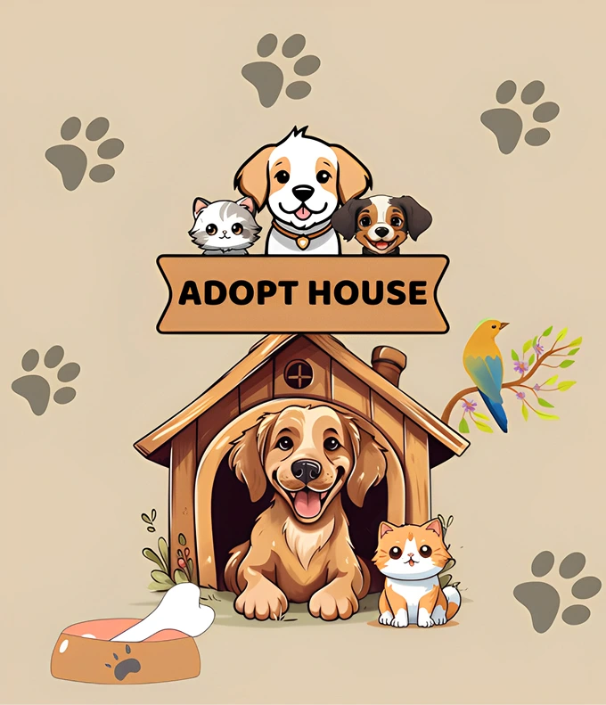

# Adopt House Project



Ini adalah aplikasi web berbasis React + Vite untuk mencari dan mengadopsi hewan peliharaan. Proyek ini menyediakan fitur-fitur seperti menelusuri kategori hewan peliharaan, memfilter berdasarkan ras, usia, jenis kelamin, dan lokasi, serta mengelola favorit dan kiriman pengguna.

## Features

- Penelusuran dan filtering hewan peliharaan berdasarkan kategori, ras, usia, jenis kelamin, dan kota.
- Otentikasi pengguna dan manajemen profil.
- Hewan peliharaan favorit dan kelola postingan.
- Image Clasification untuk postingan hewan
- Desain responsif untuk desktop dan seluler.
- Animasi halus menggunakan Framer Motion.
- Dashboard admin untuk mengelola kategori dan postingan.
- Rekomendasi hewan peliharaan

## Getting Started

### Prerequisites

- Node.js (v14 or higher)
- npm or yarn package manager

### Installation

1. Clone the repository:

```bash
git clone https://github.com/capstoneadoptpet/frontendcapstone.git
cd frontendcapstone
```

2. Install dependencies:

```bash
npm install
# or
yarn install
```

3. Start the development server:

```bash
npm run dev
# or
yarn dev
```

4. Open your browser and navigate to `http://localhost:3000` (or the port shown in the terminal).

## Project Structure

- `src/pages` - Main pages of the application.
- `src/components` - Reusable React components.
- `src/assets` - Images and static assets.
- `src/styles` - CSS and styling files.

## Technologies Used

- React
- Vite
- Tailwind CSS
- Framer Motion
- React Router
- Flowbite React

## License

This project is licensed under the MIT License.

## Capstone Team Project

1. [Rizqi Maulidi (MC224D5Y1546)](https://github.com/rizqi-maulidi) - Machine Learning as a Team Lead  
2. [Bagas Rizky Ramadhan (MC001D5Y1201)](https://github.com/Bagas30-mm) - Machine Learning  
3. [Deffin Purnama Noer (MC224D5Y0523)](https://github.com/deffinpurnama) - Machine Learning  
4. [Agung Maulana Saputra (FC193D5Y1198)](https://github.com/agung7703) - Front End Back End as a UI/UX Designer & Front-End Developer  
5. [Jason Chainara Putra (FC325D5Y0822)](https://github.com/JasonFTI45) - Front End Back End as a Full-Stack Developer  
6. [Samuel Maruba Manik (FC406D5Y1918)](https://github.com/Redfly54) - Front End Back End as a Back-End Developer  
